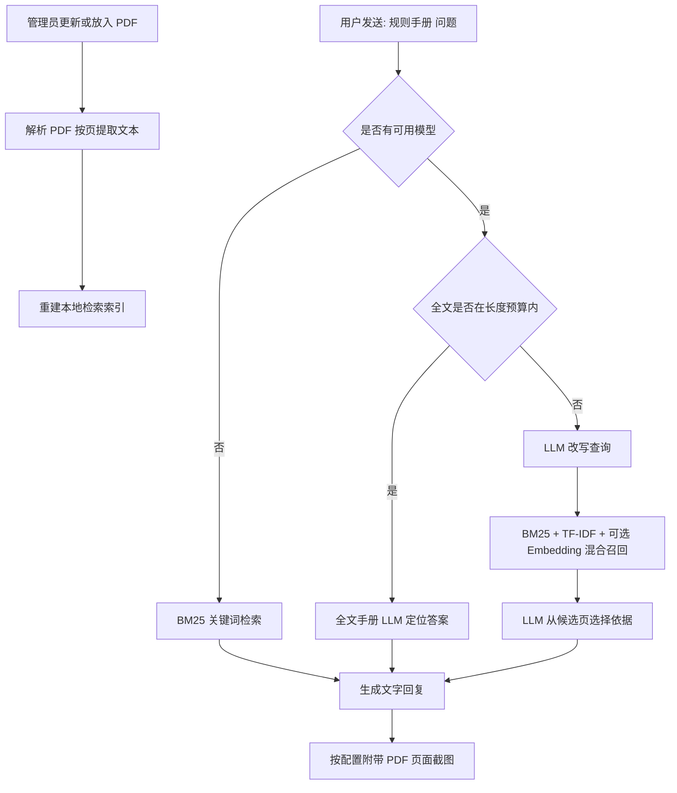
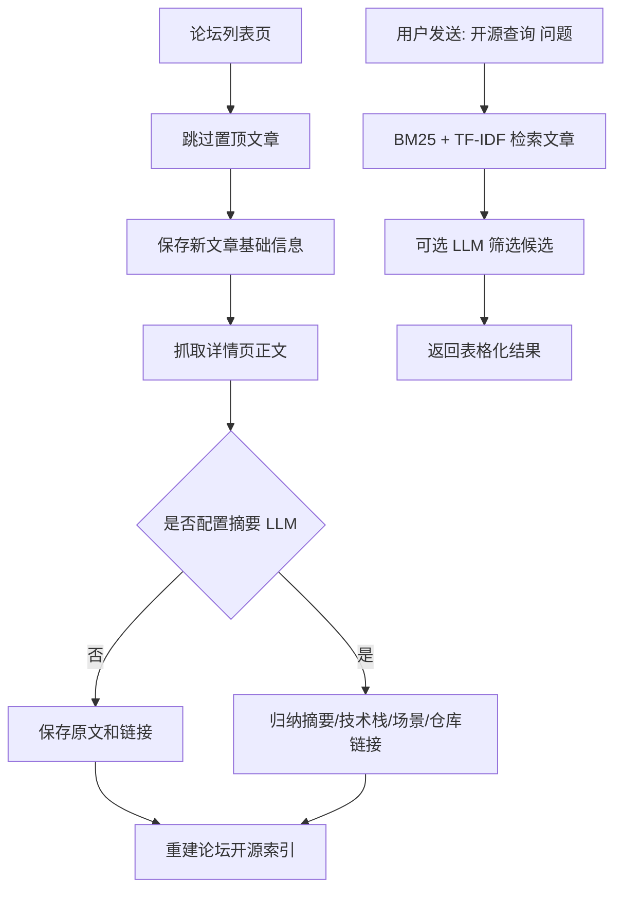

<div align="center">


# RoboMaster赛事助手

[](https://github.com/CUBOT-robomaster/astrbot_plugin_robomaster_assistant)
[](https://github.com/AstrBotDevs/AstrBot)
[](https://www.python.org/)
[](LICENSE)
[](https://github.com/CUBOT-robomaster/astrbot_plugin_robomaster_assistant)

</div>

RoboMaster赛事助手可以在群聊里检索规则手册、监控 RoboMaster 官网公告、监控比赛状态、沉淀论坛开源资料并主动推送通知。

目前支持 QQ/OneBot、QQ 官方接口和飞书。

## 快速开始

1. 在管理员会话里发送：

   ```text
   更新规则手册 https://example.com/example1.pdf
   ```

2. 如果还有其他手册，再发一次对应链接，例如：

   ```text
   更新规则手册 https://example.com/example2.pdf
   ```

3. 看到“规则手册更新完成”后，就可以在群里查询：

   ```text
   规则手册 自定义客户端
   规则手册 裁判系统串口协议
   规则手册 图传链路
   ```

更新规则手册时，插件会自动下载 PDF、替换旧版本、清理同类旧手册，并重建检索索引。不需要再手动发送重建索引命令。

## 常用命令

普通用户可用：

- `规则手册 关键词/问题`
- `规则手册帮助`
- `开源查询 关键词/问题`
- `开源查询帮助`

管理员可用：

- `更新规则手册 HTTPS下载链接`
- `重建规则手册索引`
- `RM开源检查`
- `RM开源重建索引`
- `RM开源导入`
- `RM订阅通知`
- `RM取消订阅`
- `RM监控状态`
- `RM公告检查`
- `RM赛事检查`

`更新规则手册` 后面必须接一个 HTTPS 下载链接。消息里有多个链接时，插件只处理第一个 HTTPS 链接。

`重建规则手册索引` 主要用于手动修复，或者你自己把 PDF 放进手册目录后重新扫描。

`开源查询` 会检索已经保存到本地资料库的 RoboMaster 论坛文章，例如：

```text
开源查询 自瞄
开源查询 电控代码
开源查询 视觉定位
```

## 规则手册配置

### 下载手册

在配置页面进入 **规则手册** -> **规则手册下载**。

- **单个手册最大 MB**：默认 500，超过大小会拒绝下载。
- **下载超时秒数**：默认 600。
- **剩余空间预留 MB**：默认 200，磁盘空间不够时会拒绝下载。

下载链接在管理员命令里发送。插件只接受 HTTPS 链接，不接受 HTTP 链接。下载失败时会删除临时文件；如果新 PDF 下载成功但解析或建索引失败，会回滚到旧文件和旧索引。

自动下载的手册会保存在 **规则手册 PDF 保存与扫描目录** 中。默认目录通常是 `data/plugin_data/astrbot_plugin_robomaster_assistant/manuals`。

### 手动放 PDF

更推荐使用上面的自动下载方式。如果你想手动维护 PDF，可以在配置页面进入 **规则手册** -> **规则手册文件与检索**，填写 **规则手册 PDF 保存与扫描目录**，然后把 PDF 放进那个目录，再发送：

```text
重建规则手册索引
```

默认目录是 `data/plugin_data/astrbot_plugin_robomaster_assistant/manuals`，也就是 AstrBot 插件数据目录下的 `manuals`。如果填写其他目录，插件会把自动下载的 PDF 保存到那里，重建索引和检索也会扫描那里。

### 限制哪些群能用

在配置页面进入 **规则手册** -> **规则手册文件与检索**。

- **会话白名单**：留空表示所有群/会话都可以用。填写后，只有名单里的会话能用。
- **会话黑名单**：填写后，名单里的会话不能用。黑名单优先级高于白名单。

不知道会话 ID 时，可以在目标群里发送 `/sid` 获取。多个 ID 可以用逗号、空格或换行分隔。

### 回复和截图

在配置页面进入 **规则手册** -> **回复与截图**。

- **回复模式**：默认图文消息。想只发文字可以填 `text`；QQ/OneBot 想用合并转发可以填 `forward`；想文字和截图都发可以填 `both`。
- **PDF 截图清晰度**：默认 1.8。越高越清晰，图片也越大。
- **按原文定位裁剪截图**：默认开启。关闭后会发送整页截图。
- **飞书文字图片分开发送**：建议保持开启，避免飞书图文消息丢文字。

### LLM 辅助定位

在配置页面进入 **规则手册** -> **规则手册 LLM 定位**。

如果当前会话有可用模型，插件会根据手册全文长度自动选择检索路径。全文按页文本没有超过预算时，直接交给全文手册 LLM 查询；超过预算时，会先把用户问题改写成多条适合关键词检索的查询，再通过 BM25、插件内 TF-IDF 向量检索和可选 Embedding 语义检索混合召回候选页，让模型从候选页里挑最相关依据，并给出简短结论。没有模型时会自动退回原关键词检索。

检索流程大致如下：



大多数情况下保持默认即可。觉得口语化问题召回不准，可以保持 **启用 LLM 查询改写**；觉得模型看得不够全，可以调大 **LLM 候选页数** 或 **每路改写召回上限**；觉得截图太多，可以设置 **LLM 截图上限**。

**规则手册检索模式** 默认是 `auto`：

- `auto`：全文按页文本小于预算时直接使用全文 LLM；超过预算时使用 BM25 + TF-IDF + 可选 Embedding 混合检索，候选不足或模型没选出依据时退回全文 LLM。
- `hybrid`：只用 BM25 + TF-IDF + 可选 Embedding 混合检索，再让模型从候选页中选择依据。
- `full_llm`：直接把 PDF 提取出的按页文本输入全文手册 LLM。
- `keyword`：只用 BM25 关键词检索，不使用向量和全文 LLM。

TF-IDF 向量检索是插件内置的轻量稀疏向量检索，不依赖 AstrBot WebUI 的知识库。Embedding 语义检索需要先在 AstrBot 服务提供商中新增 Embedding 类型提供商，再打开 **启用嵌入模型检索** 并填写 **嵌入模型提供商 ID**；首次使用会为手册页面生成嵌入缓存，之后查询会复用缓存。全文模式适合 1M 上下文这类长上下文模型，但输入的是 PDF 已提取出的按页文本，不是 PDF 二进制文件。

如果 AstrBot 里配置了多个大模型，可以分别选择：

- **查询改写 LLM**：把口语化问题改写成适合关键词检索的查询。
- **候选依据选择 LLM**：从 BM25 候选页里选择依据、生成简短结论和截图定位短句。
- **全文手册 LLM**：用于直接把规则手册全文按页文本输入模型的模式，建议选择支持长上下文的模型。

这些选项留空时，会使用当前会话正在使用的模型。

## 论坛开源资料

论坛开源资料用于监控 RoboMaster 论坛非置顶文章，保存标题、作者、分类、发布时间、详情正文和链接，再生成本地检索索引。首次启用监控时只建库不推送，避免把历史文章刷屏；后续发现新文章时会推送到 `RM订阅通知` 的会话。

### 开启论坛监控

1. 安装 Playwright 浏览器依赖：

   ```bash
   pip install playwright
   python -m playwright install chromium
   ```

   如果云服务器已经安装了 Chromium，也可以在配置里填写 **Chromium 可执行文件路径**，或设置环境变量 `PLAYWRIGHT_CHROMIUM_EXECUTABLE_PATH`。

2. 在本地浏览器登录 RoboMaster 论坛，确认能访问文章内容。云服务器容易因为 IP 风控或滑块验证登录失败，建议把本地登录态导出为 cookies 后上传到：

   ```text
   data/plugin_data/astrbot_plugin_robomaster_assistant/forum/cookies.json
   ```

   cookies 等同于账号凭证，只放在自己的服务器上，不要公开提交。

3. 在配置页面进入 **论坛开源监控** -> **论坛抓取**，打开 **开启论坛开源监控**。

4. 建议检查间隔保持默认 300 秒或更长。插件会复用浏览器实例，每次检查新建页面上下文，并模拟随机等待、滚动和较新的 Chrome User-Agent，降低触发风控的概率。

### LLM 归纳成本

在配置页面进入 **论坛开源监控** -> **开源 LLM 归纳**。

- **开源摘要 LLM**：留空时不会调用模型，只保存文章原文和基础信息。
- **单篇摘要最大字符数**：默认 6000 字符。粗略估计单篇约 2k 到 5k tokens；默认每次最多处理 10 篇文章，首次建库可能消耗约 20k 到 50k tokens。

详情页正文抓取是本插件新增能力，不是参考 Go 项目已有功能。论坛页面可能由前端异步接口加载正文；如果直接 HTML 提取效果不好，建议先在本地浏览器开发者工具 Network 面板确认详情页正文接口、必要 cookies、User-Agent 和 Referer，再更新抓取策略。

### 开源查询流程



外部侧车程序可以把文章写成 JSONL 后放到：

```text
data/plugin_data/astrbot_plugin_robomaster_assistant/forum/imports/*.jsonl
```

然后发送 `RM开源导入`。每行至少包含 `title` 和 `url`，可选 `author`、`category`、`posted_at`、`raw_text`、`repo_links`。

## 公告通知

公告通知用于监控 RoboMaster 官网公告新增，以及指定公告页面正文变化。

### 开启公告推送

1. 在想接收通知的群/会话里发送：

   ```text
   RM订阅通知
   ```

   这条命令只负责把当前群/会话加入“通知接收列表”，不是单独的公告开关。

2. 在配置页面进入 **公告通知** -> **RM 公告监控**。
3. 打开 **开启 RM 公告监控**。
4. 建议重载或重启插件，让后台监控任务按新配置启动。

### 常用公告设置

- **公告检查间隔秒数**：默认 60，建议不要低于 15。
- **公告最后 ID**：首次监控的起点。建议填当前已知最新公告 ID，避免误报很早以前的历史公告。
- **监控公告页面 ID**：想监控某个公告正文是否变化，就填公告链接末尾的数字 ID。多个 ID 可以用逗号、空格或换行分隔。

## 赛事通知

赛事通知会定时拉取 RoboMaster 赛事接口，识别比赛开始、单局结束和比赛结束。

### 开启赛事推送

1. 在想接收通知的群/会话里发送：

   ```text
   RM订阅通知
   ```

   公告和赛事共用同一个“通知接收列表”，所以这里也是 `RM订阅通知`。是否推送赛事，由下面的赛事监控开关决定。

2. 在配置页面进入 **赛事通知** -> **RM 赛事监控**。
3. 打开 **开启 RM 赛事监控**。
4. 建议重载或重启插件。

### 常用赛事设置

- **赛事检查间隔秒数**：默认 30。想更及时可以调到 10 到 15。
- **赛事监控赛区白名单**：留空表示监控全部赛区。只想看部分赛区时，填写赛区名称，多个值用逗号、空格或换行分隔。
- **DJI 当前比赛接口** 和 **DJI 赛程接口**：默认已经填好，接口变更时才需要修改。

## 飞书卡片和外部 Webhook

在配置页面进入 **公告通知** -> **RM 通知订阅**。

- **启用飞书卡片通知**：开启后，需要先在飞书会话里发送一次 `RM订阅通知`。如果飞书卡片不可用，插件会自动降级为普通文本。
- **RM 通知会话**：适合填写固定推送目标；一般用户直接用 `RM订阅通知` 更方便。

在配置页面进入 **赛事通知** -> **外部 Webhook**。

- **开启外部 Webhook**：开启后，公告和赛事事件会额外 POST 到你填写的地址。
- **外部 Webhook 地址**：可以填一个或多个 HTTP/HTTPS 地址，多个地址用逗号、空格或换行分隔。

## 安全说明

规则手册下载只允许管理员触发，并且只接受 HTTPS 链接。

插件会检查下载大小、磁盘剩余空间和 PDF 文件头，但 PDF 文件头只能说明文件“看起来像 PDF”，不能证明 PDF 内容绝对安全。PDF 后续仍会被解析库读取，理论上仍可能触发解析库漏洞。

如果 AstrBot 部署在 Docker 里，建议容器使用非 root 用户运行，只挂载必要的 `data/` 目录，不要把宿主机敏感目录挂进容器，并且只使用可信下载链接。

## License

Apache License 2.0
